# Assessing environmental drivers of Olympia oyster population genetic diversity in Puget Sound, WA

[PDF](../Roberts-RDA.pdf) · [PPTX](../Roberts-RDA.pptx) · [Back to README](../README.md)

### Slide 1

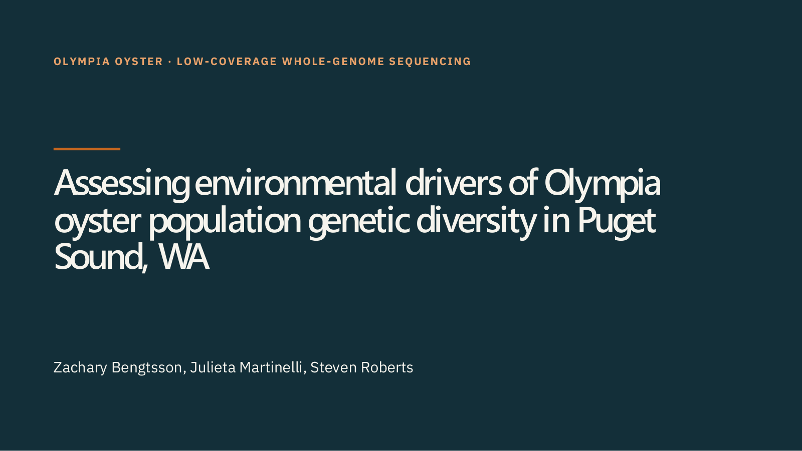

### Slide 2

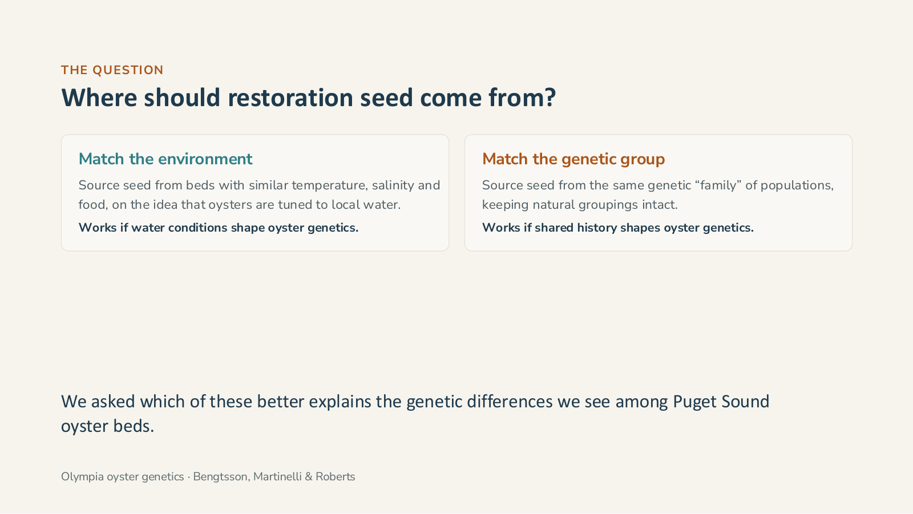

### Slide 3

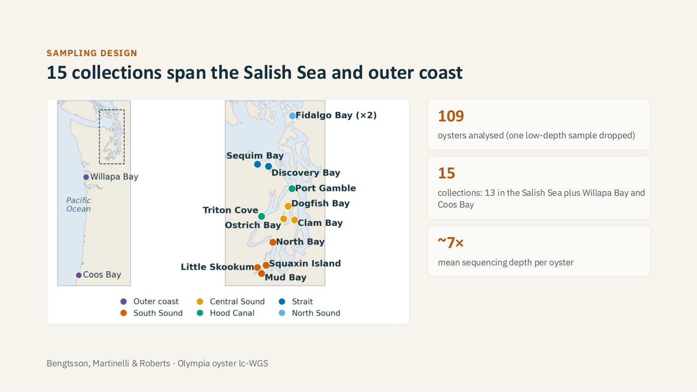

### Slide 4

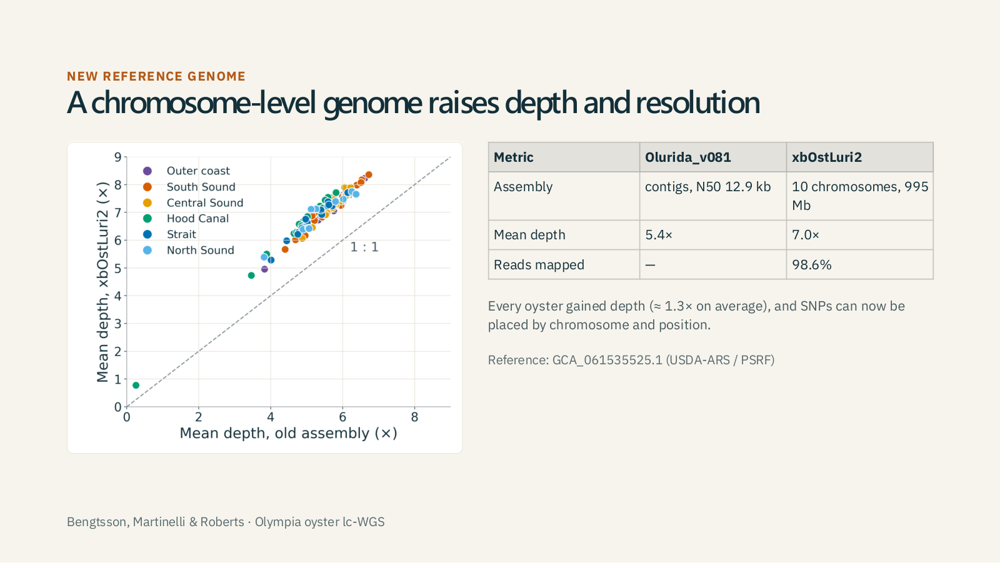

### Slide 5

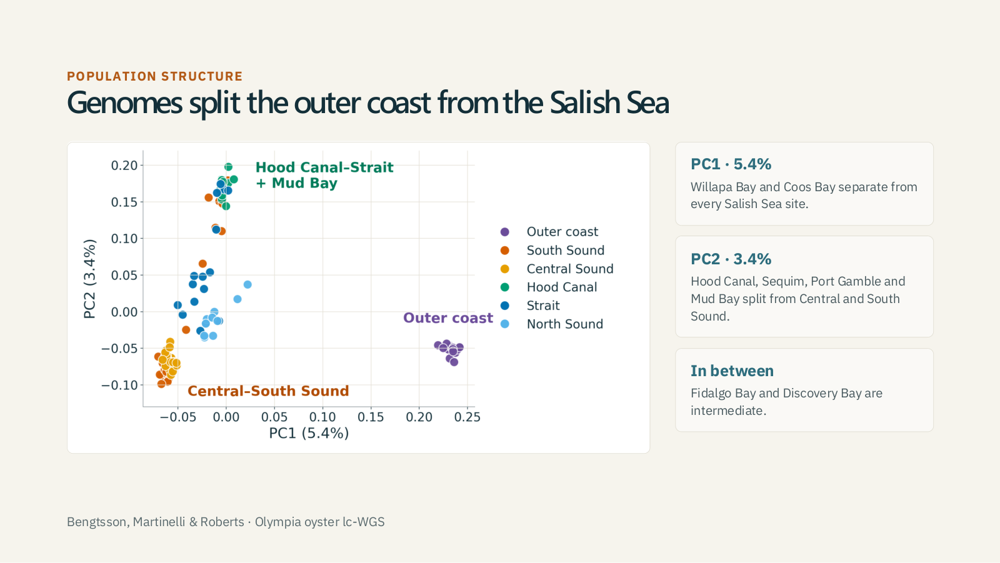

### Slide 6

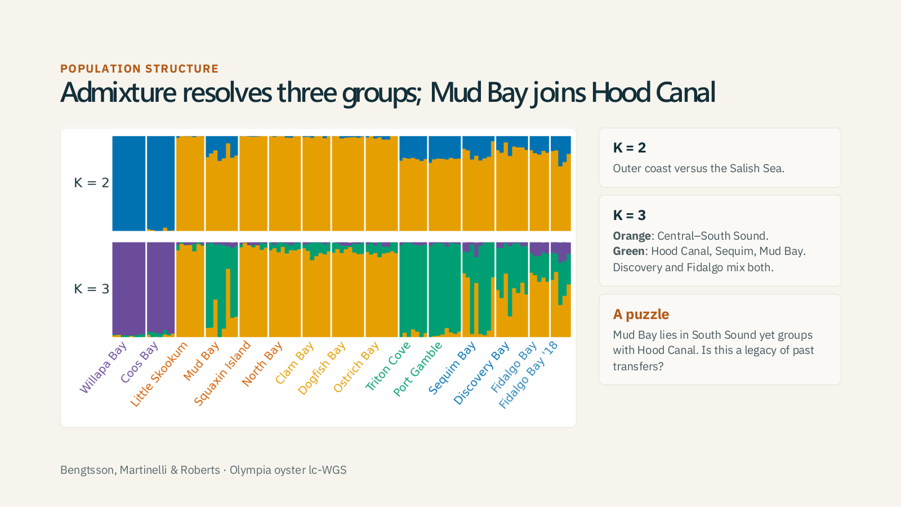

### Slide 7

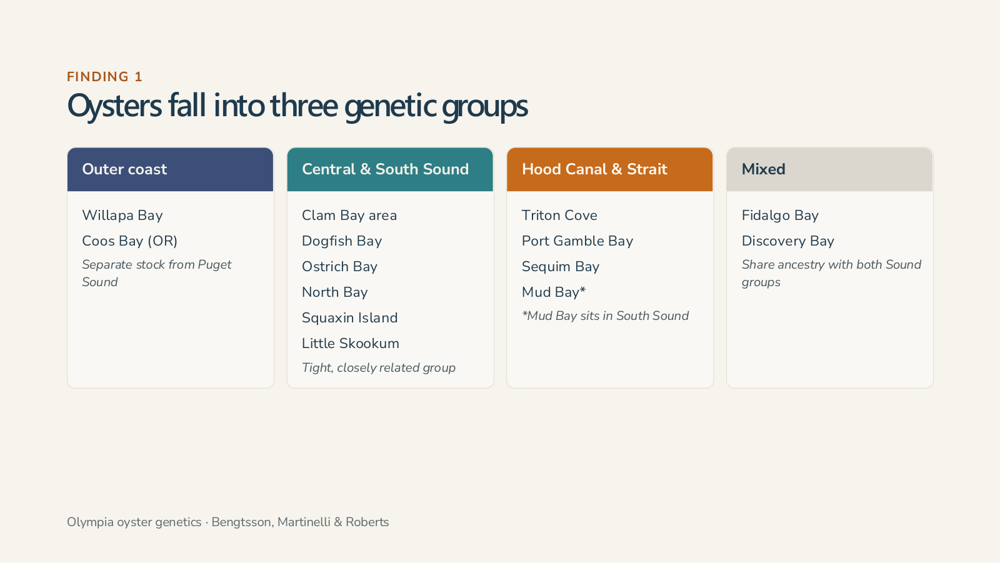

### Slide 8

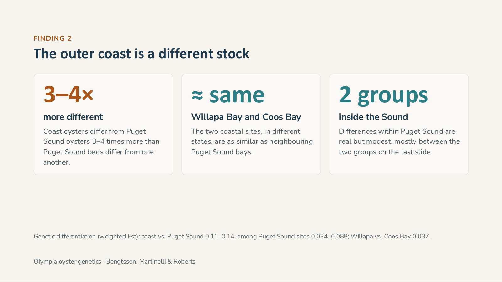

### Slide 9

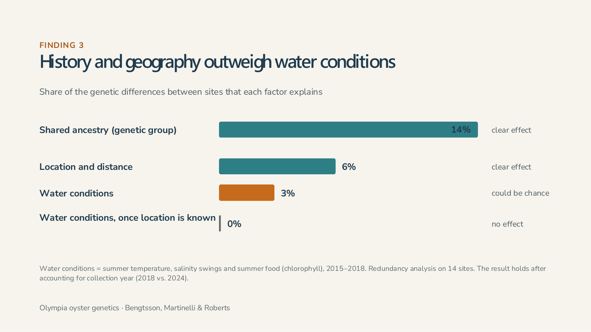

### Slide 10

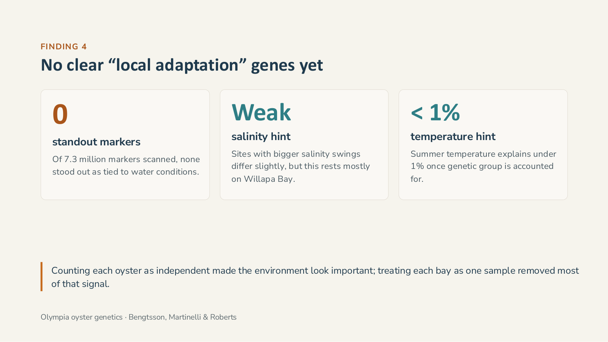

### Slide 11

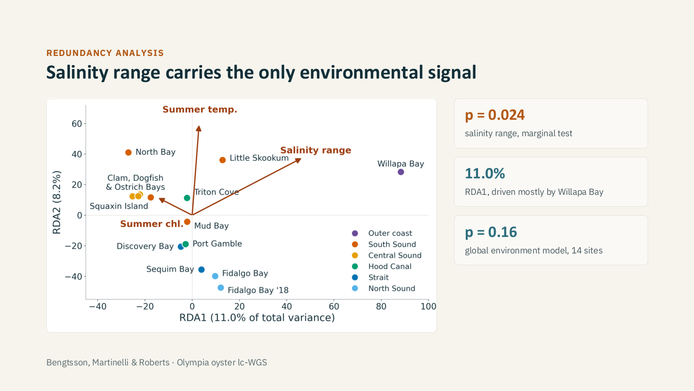

### Slide 12

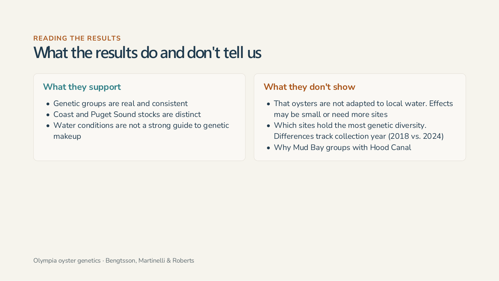

### Slide 13

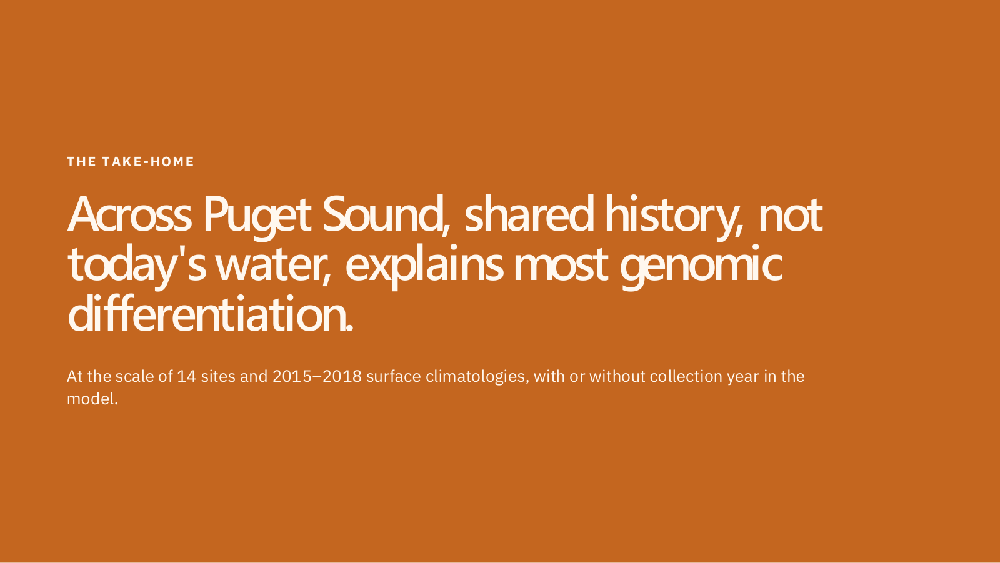

### Slide 14

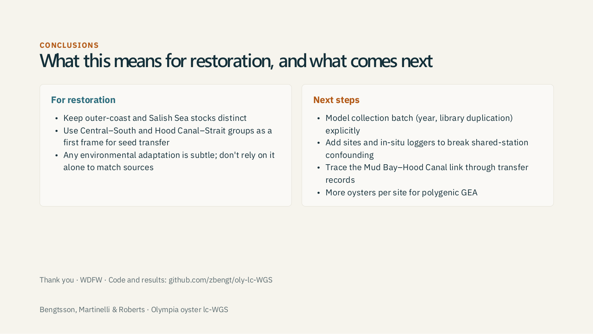
